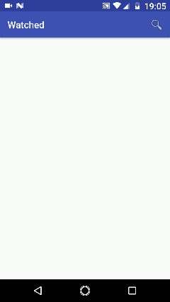

# Watched an Android Native Application

This App was created with the objective of explore new features of Android development.

* 100% Kotlin
* Multi Module Gradle Project (feature modules)
* MVVM Android Architecture
* Architecture Components: ViewModel, LiveData, etc.
* Dagger 2.14
* RxJava 2 & RxAndroid 2
* Retrofit 2
* Glide
* Constraint Layout
* GSON
* OMDB API (Series/Filmes)

**Attention: For build project, it's necessary to replace OMDB_API_KEY on `android-common-config.gradle` for a [valid key](http://www.omdbapi.com/apikey.aspx).**

#### Demo:
